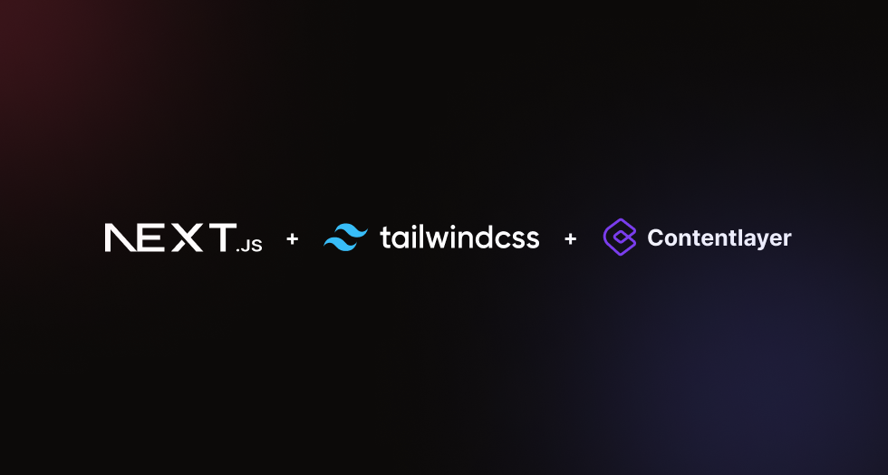

<div align="center">
  
  <h1>Next.js Tailwind Contentlayer Blog </h1>
  <a href="https://github.com/schardev/
nextjs-contentlayer-blog/actions/workflows/build.yml">
    
  </a>
</div>
<p align="center">A simple and minimalistic blog template built using the latest Next.js app router and Contentlayer.</p>
<br/>

## Motive

I created this blog template as a learning experience (and to get my hands dirty) with [Next.js' new shiny app router](https://nextjs.org/docs/app). I also wanted few specific reusable functionalities for my personal portfolio blog that I can also easily copy-paste to my other projects. Developing a generic template seemed like a better way of achieving that.

## Features

- **Mobile-First Approach**: Built with a mobile-first mindset, the template ensures your blog looks fantastic on any device.

- **Highly Customizable**: Flexibility is key! The template offers extensive customizability, allowing you to tailor it to your unique style and preferences.

- **CSS Variables for Easier Customizations**: Making changes to your blog's appearance becomes a breeze with the help of CSS variables.

- **Keyboard Accessibility**: Ensuring an inclusive experience, the template is keyboard accessible.

- **Light and Dark Mode Support**: Embrace the latest design trends by offering both light and dark mode options.

- **Full Type-Safety**: Rest assured that your codebase will be free of type-related headaches.

- **JSX in Markdown Support**: Unleash the power of JSX right within your Markdown content.

- **Near Perfect Lighthouse Scores**: Your blog will be optimized for blazing-fast performance and excellent user experience.

- **VS Code-like Code Highlighting**: Code snippets are displayed beautifully with line numbers, line highlighting, words highlighting, and inline code highlighting, powered by [Rehype Pretty Code](https://rehype-pretty-code.netlify.app/).

- **Github-Flavored Markdown Support**: Write your content in familiar Markdown, including GitHub-flavored goodness.

- **Separate Pages for Tags**: Easily categorize your posts with separate tag pages.

- **Out-of-the-Box SEO Support**: Ensure your blog ranks well on search engines with built-in SEO features.

- **Dynamic Open-Graph (OG) Image Generation**: Each post will have a sleek OG image automatically generated.

- **Automatic Image Optimizations**: The template takes care of image optimizations using `next/image` for optimal performance.

- **Bleeding Edge Technologies and Best Practices**: Stay ahead of the curve with the latest technologies and industry best practices (I hope so).

## Features Not Implemented (yet)

Although packed with awesome features, there are some ideas on the horizon that I'm eager to implement in future updates:

- **Views Counter / Analytics**: Keep track of your blog's popularity and engagement.

- **Cloudinary Support**: Easily manage and optimize your images with Cloudinary integration.

- **Comments**: Foster discussions and interactions by adding comment functionality.

- **Search Blog Posts / Tags**: Help users find specific content with a powerful search feature.

- **Mermaid Support**: Visualize data and concepts with the help of Mermaid charts.

- **Author Support**: Properly attribute authors to each post.

- **Custom Layout**: Create a unique layout for individual posts.

## Theme

Currently, the template offers two theme variations: **Slate** and **Stone**. But don't worry, you have the freedom to create own theme by customising and tweaking `config.css`.

## Getting Started

1. Clone the starter template:

```bash
git clone https://github.com/schardev/nextjs-contentlayer-blog

# or using `gh`
gh repo clone schardev/nextjs-contentlayer-blog
```

2. Add site information and relevant data to `lib/siteConfig.ts`.
3. Add your blog posts to `content/blog` directory with proper front-matter (see available fields [here](https://github.com/schardev/nextjs-contentlayer-blog/blob/main/schema/contentlayer/blog-post.ts))
4. Build your blog with:

```bash
pnpm build
```

5. Deploy to your hosting provider 🎉

Starting a development server isn't different either, just run:

```bash
pnpm dev
```

Now open `http://localhost:3000` to view changes to your blog as it happens.

## Directory and File Structure

| Directory/File           | Notes                                                                                                           |
| ------------------------ | --------------------------------------------------------------------------------------------------------------- |
| `app/`                   | Defines your site/blog's routes                                                                                 |
| `components/`            | All react component code lives here                                                                             |
| `content/`               | Directory where your MDX or Markdown file lives                                                                 |
| `public/`                | Static assets goes here (e.g., put all your images inside `public/images` and fonts inside `public/fonts` etc)  |
| `styles/`                | Find all styling files here                                                                                     |
| `schema/`                | Contains schema-related files                                                                                   |
| `contentlayer.config.ts` | [Contentlayer](https://www.contentlayer.dev/) configuration file (you can change your `content` directory here) |
| `lib/siteConfig.ts`      | Holds config related to the site itself                                                                         |

## Additional notes

- If you have worked with [`next/image`](https://nextjs.org/docs/app/api-reference/components/image) before you know that working with external images is a pain in the ass, as you have to manually inspect and pass width and height properties to the `<Image/>` component. Sure you can use `fill` property but then you have to have a fixed aspect ratio and/or deal with z-indexes. However, working with external images is now a breeze. Use the custom `<Image/>` component from the `components/` directory that takes care of all of it. No more manual width and height hassles, as image optimizations are automatically handled.

- Additionally, code blocks support everything [`rehype-pretty-code`](https://rehype-pretty-code.netlify.app/) supports. You even get the bonus of file type icons! You can also extend or customize the default file type icons from [here](https://github.com/schardev/nextjs-contentlayer-blog/blob/main/components/brand-icon.tsx).

- As mentioned already, styling is mostly controlled via CSS variables so it's pretty easy to tweak and configure. See [`config.css`](https://github.com/schardev/nextjs-contentlayer-blog/blob/main/styles/config.css).

> **Note**:
>
> Image optimisations using custom `<Image/>` component only works if your blog is statically generated. **Do not use it as a client or server component.**

If you encounter any issues or have any feature requests, feel free to report them in the [main repository](https://github.com/schardev/nextjs-contentlayer-blog/tree/main).

## Inspirations

- [Tailwind Nextjs Starter Blog](https://github.com/timlrx/tailwind-nextjs-starter-blog)
- [Stackoverflow Blog](https://stackoverflow.blog/)
- [Material UI Blog](https://mui.com/blog/)
- [Web Bulletin](https://web-bulletin.vercel.app/)

## Licence

MIT © [Saurabh Charde](https://schar.dev)

Feel free to use this in whatever projects you like. Make sure to star the [repo](https://github.com/schardev/nextjs-contentlayer-blog) if you like it.

